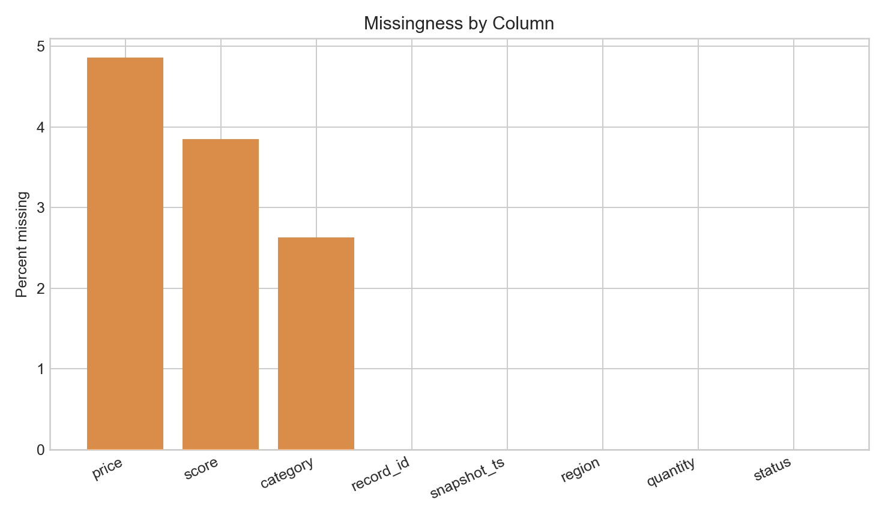
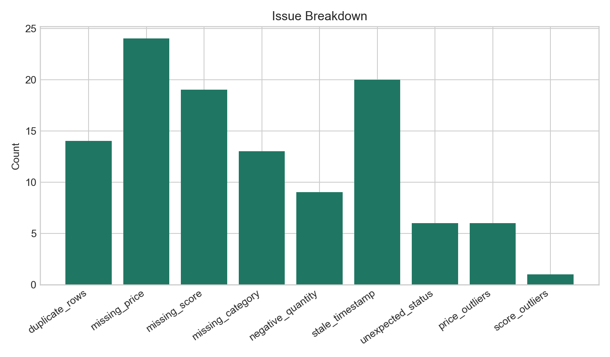

<div align="center">
  <h1>Data Quality Toolkit</h1>
  <p><strong>A lightweight validation toolkit for checking missingness, duplicates, stale timestamps, outliers, and category issues.</strong></p>
  <p>Built to show reusable engineering patterns around data reliability and monitoring.</p>
</div>

<p align="center">
  <code>data quality</code>
  <code>validation tooling</code>
  <code>report generation</code>
  <code>monitoring logic</code>
  <code>synthetic sample data</code>
</p>

## Preview





## Why This Project Matters

This project complements a dashboard demo and a quant research project by showing a third skill set: tool-building.

It demonstrates how to:

- inspect raw datasets systematically
- define clear validation checks
- generate repeatable quality summaries
- present technical findings in a readable format

## Project Structure

- `data/`: sample raw data and generated summaries
- `figures/`: visualization output
- `reports/`: markdown report produced by the checker
- `src/`: data generation and validation code

## Quick Start

```bash
python3 -m venv .venv
source .venv/bin/activate
pip install -r requirements.txt
python src/generate_sample_data.py
python src/run_checks.py
```

## Checks included

- row count and duplicate detection
- missing-value profile by column
- negative and impossible numeric values
- stale timestamp detection
- unexpected category inspection
- simple outlier detection using z-score style thresholds

## Outputs

After running the scripts, you should see:

- `data/sample_records.csv`
- `data/check_summary.csv`
- `reports/data_quality_report.md`
- `figures/missingness_by_column.png`
- `figures/issue_breakdown.png`

## Notes

- This is a compact, explainable toolkit rather than a production-grade validation framework.
- The project is meant to show reusable validation patterns, reporting, and data-reliability thinking.
